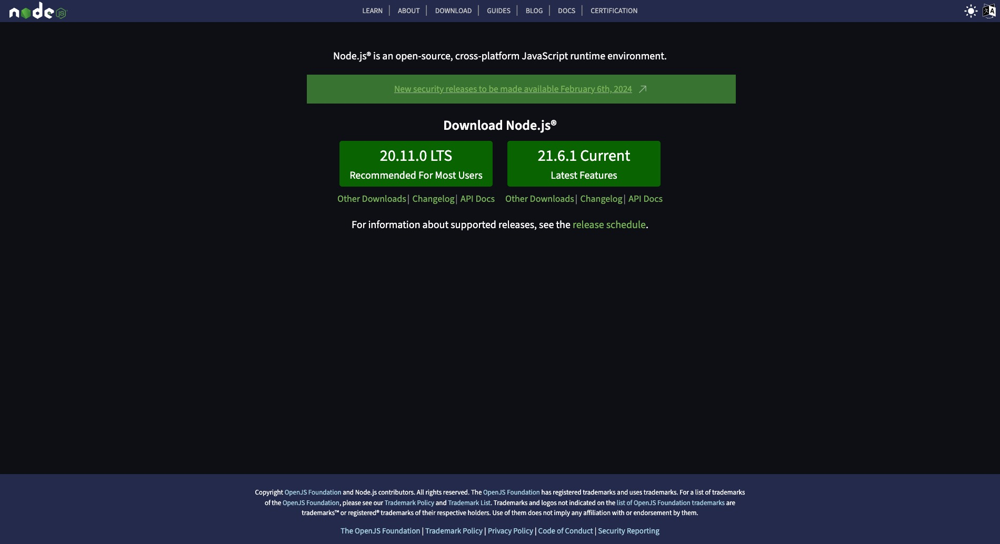
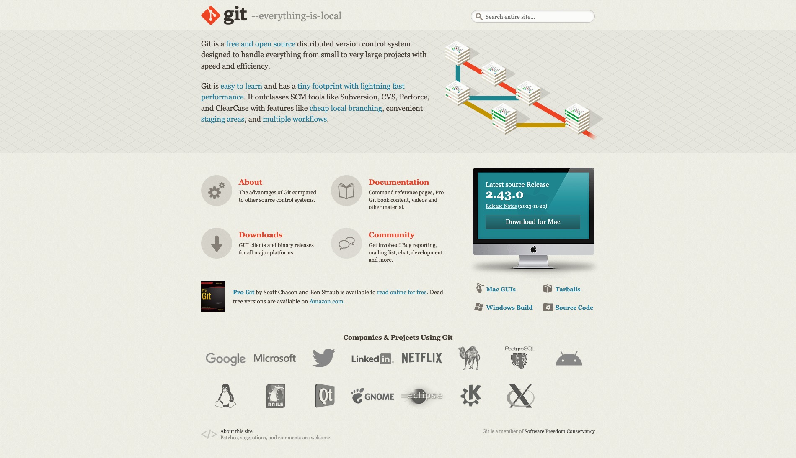
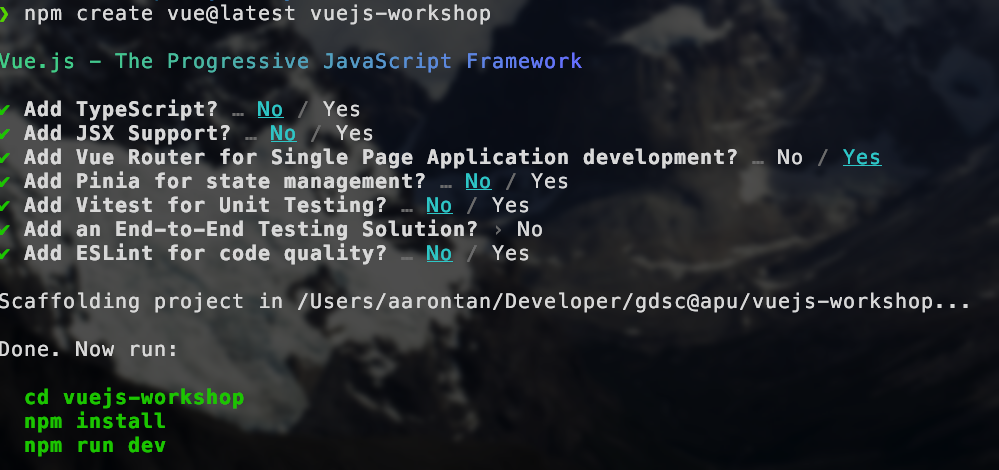

# Vuejs-Workshop

## Installation Guide

### First Step

First go to https://nodejs.org/en this website and install NodeJs. Any version will be fine but LTS is recommended!



#### MacOS users only!!!

MacOS users if you are familiar with homebrew you can install using this command:

```bash
brew install node
```

### Second Step

Second, go to this https://git-scm.com/ and install git on your machine. Choose the latest version will do.

#### MacOS users only!!!

MacOS users for git it is already installed by default. So there is no need to install again.



After installing git, you would have to setup a bit for your git to work. Open up your terminal and type the below in:

```bash
git config --global user.name "John Doe"
git config --global user.email johndoe@example.com
```

If you don't have a Github account please do sign up for one as well! Simply click the `Sign In` button on your top right or you may click on this [link](https://github.com/login?return_to=https%3A%2F%2Fgithub.com%2Fgdsc-apu%2Fvuejs-workshop) that links to there as well.

### Third Step

Then open your terminal in vscode or cmd in windows and run the command below:

```bash
npm create vue@latest vuejs-workshop
```

```bash
cd vuejs-workshop

npm install
```

After that choose the options accordingly with this image below:



### Fourth Step

We are using Tailwindcss and Shadcn-Vue ui library for this workshop to be save time... and also because Shadcn looks cool! 🔥

So run these commands to install Tailwind Css first:

```bash
npm install -D tailwindcss postcss autoprefixer
npx tailwindcss init -p
```

Then install shadcn-vue:

```bash
npx shadcn-vue@latest init
```

After that would be asked a few questions, please choose the options according to below:

```bash
Would you like to use TypeScript (recommended)? no
Which framework are you using? Vite
Which style would you like to use? › Default
Which color would you like to use as base color? › Slate
Where is your global CSS file? › › src/assets/base.css
Do you want to use CSS variables for colors? › yes
Where is your tailwind.config.js located? › tailwind.config.js
Configure the import alias for components: › @/components
Configure the import alias for utils: › @/lib/utils
```

# And.. You are ready to go !!!

Hi I'm Wei Hup, GDSC Web Development Department Lead and will be your speaker for this workshop.

Hope that you guys can learn a thing or two from this workshop and I'm open to feedbacks after the workshop ends. 🤗

# Side note !!! Important

This workshop as it is focused on VueJs, I will not be teaching much about how to setup with Git and Github. I will only be doing it if time allows. You can ping me in Whatsapp or Discord if there is anything you want to ask still.
